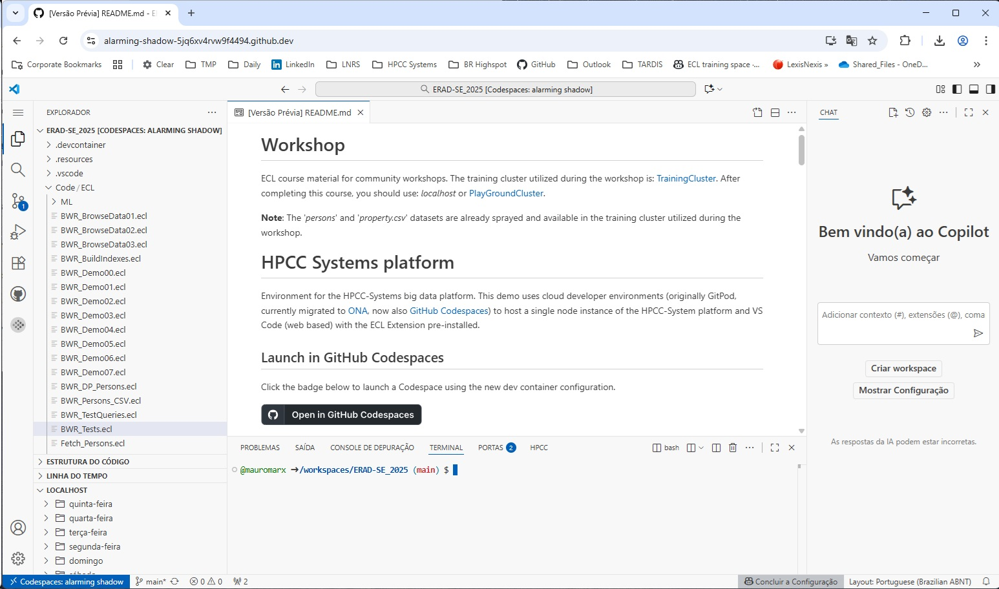
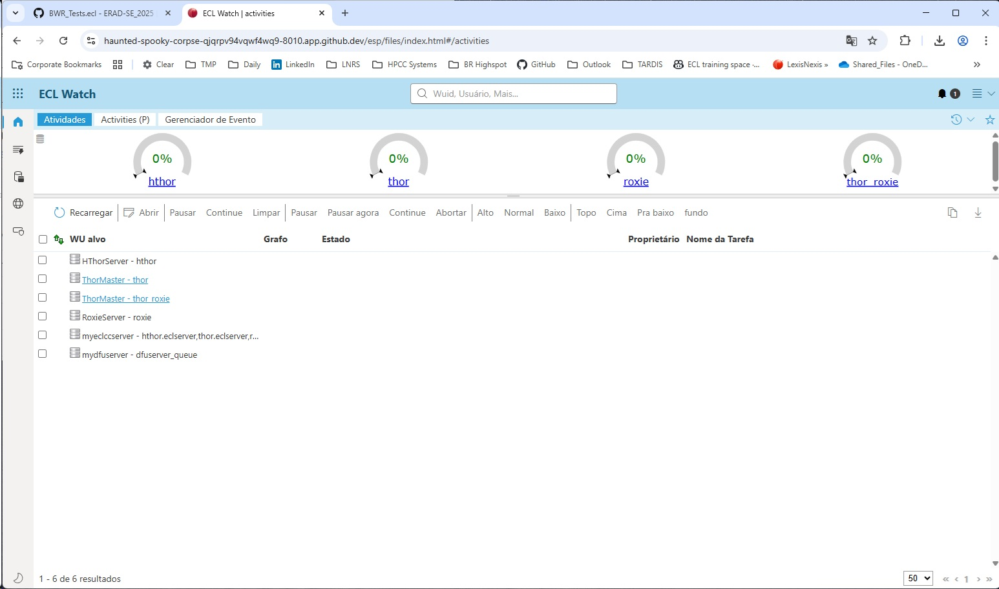

# Workshop

ECL course material for community workshops. The training cluster utilized during the workshop is: [TrainingCluster](https://eclwatch.br-training-prod.azure.lnrsg.io:18010/). After completing this course, you should use: *localhost* or [PlayGroundCluster](https://play.hpccsystems.com:18010/).

**Note**: The '*persons*' and '*property.csv*' datasets are already sprayed and available in the training cluster utilized during the workshop.

# HPCC Systems platform

Environment for the HPCC-Systems big data platform.  This demo uses cloud developer environments (originally GitPod, currently migrated to [ONA](https://gitpod.io), now also [GitHub Codespaces](https://github.com/features/codespaces)) to host a single node instance of the HPCC-System platform and VS Code (web based) with the ECL Extension pre-installed.

## Launch in GitHub Codespaces

Click the badge below to launch a Codespace using the new dev container configuration.

The Codespaces environment will:

* Build a custom container (see `.devcontainer/Dockerfile`) installing HPCC Systems platform 9.14.22-1 version
* Auto-start the HPCC services (`postStartCommand` runs `start-hpcc.sh` and `install-bundles.sh`)
* Forward port `8010` (ECL Watch) and `8002` (Roxie) 
* Install the VS Code extensions: `hpcc-systems.ecl` and `gordonsmith.observable-js`

### Codespaces Notes

* If the HPCC services fail to start (rare), run: `start-hpcc.sh` in the integrated terminal.
* To rebuild the container after changing devcontainer files: Command Palette → “Codespaces: Rebuild Container”.
* The legacy Gitpod config (`.gitpod.yml`) remains for backward compatibility; future improvements should target the dev container.

---

## Launch in ONA

### Latest Version from "main" branch:

* [main](https://gitpod.io/#https://github.com/mauromarx/ERAD-SE_2025)

---

## Quick Start

* Expand the "Samples" folder and click on "default.ecl"

1.  Check the environment and target
2.  Click on the submit button

* Open ECL Watch by clicking on the globe

